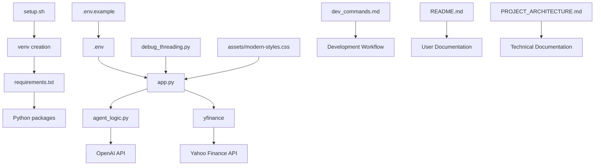

# Financial Agent Project Architecture Documentation

## 📋 Project Overview

The Financial Agent is a sophisticated web-based application that combines real-time financial data analysis with AI-powered investment recommendations. The project leverages CrewAI for multi-agent collaboration, Yahoo Finance for real-time market data, and Dash/Plotly for an interactive web interface.

### 🎯 Core Functionality
- **Real-time Stock Data Visualization** with interactive charts
- **Multi-Agent AI Analysis** using CrewAI framework
- **Comprehensive Investment Recommendations** with risk assessment
- **Multi-stock Comparison** with unique visual differentiation
- **Development Tools** for debugging and monitoring

---

## 🏗️ Architecture Overview

```
┌─────────────────────────────────────────────────────────────┐
│                    USER INTERFACE (BROWSER)                │
└─────────────────────┬───────────────────────────────────────┘
                      │ HTTP Requests/WebSocket
┌─────────────────────▼───────────────────────────────────────┐
│                  DASH WEB SERVER                           │
│                    (app.py)                                │
│  ┌─────────────────┐  ┌─────────────────┐  ┌─────────────┐ │
│  │   UI Callbacks  │  │  Data Fetching  │  │   Chart     │ │
│  │   & Routing     │  │   & Processing  │  │ Generation  │ │
│  └─────────────────┘  └─────────────────┘  └─────────────┘ │
└─────────────────────┬───────────────────────────────────────┘
                      │ Function Calls
┌─────────────────────▼───────────────────────────────────────┐
│                 AI AGENT LAYER                             │
│                 (agent_logic.py)                           │
│  ┌─────────────┐ ┌─────────────┐ ┌─────────────┐ ┌────────┐ │
│  │Data Analyst │ │Trading      │ │Execution    │ │Risk    │ │
│  │Agent        │ │Strategy     │ │Planner      │ │Manager │ │
│  │             │ │Agent        │ │Agent        │ │Agent   │ │
│  └─────────────┘ └─────────────┘ └─────────────┘ └────────┘ │
└─────────────────────┬───────────────────────────────────────┘
                      │ API Calls
┌─────────────────────▼───────────────────────────────────────┐
│                EXTERNAL SERVICES                           │
│  ┌─────────────────┐  ┌─────────────────┐  ┌─────────────┐ │
│  │  Yahoo Finance  │  │   OpenAI API    │  │ Serper API  │ │
│  │   (yfinance)    │  │   (CrewAI)      │  │(Web Search) │ │
│  └─────────────────┘  └─────────────────┘  └─────────────┘ │
└─────────────────────────────────────────────────────────────┘
```

---

## 🐍 Python Files Documentation

### 1. **app.py** - Main Application Server
**Purpose**: Core Dash web application serving the user interface and handling all user interactions.

**Key Components**:
```python
# Main sections of app.py:
├── Imports & Configuration
├── Debug Configuration (Threading & Environment)
├── Global Variables (analysis_progress, colors)
├── Helper Functions (debug_print, get_active_threads_info)
├── Mock Data Generation (create_mock_data)
├── UI Layout Definition
├── Callback Functions
│   ├── fetch_stock_data() - Real-time data fetching
│   ├── run_financial_analysis() - AI agent coordination
│   ├── run_agent_analysis_background() - Background processing
│   └── update_progress() - Real-time updates
└── Server Startup
```

**Key Functions**:
- **`fetch_stock_data(tickers, period)`**: Fetches real Yahoo Finance data with fallback to mock data
- **`run_financial_analysis()`**: Orchestrates AI agent analysis workflow
- **`run_agent_analysis_background()`**: Handles background processing with threading
- **`create_mock_data()`**: Generates realistic fallback data when APIs fail

**External Communications**:
- 🔗 **Yahoo Finance API** (via yfinance library)
- 🔗 **agent_logic.py** (function calls to run_crew_analysis)
- 🔗 **Browser** (HTTP/WebSocket via Dash framework)

---

### 2. **agent_logic.py** - AI Agent Orchestration
**Purpose**: Defines and orchestrates the CrewAI multi-agent system for financial analysis.

**Agent Architecture**:
```python
# Agent hierarchy and workflow:
Data Analyst Agent (Researcher)
    ↓ (passes market data & analysis)
Trading Strategy Agent (Strategist)
    ↓ (passes strategy recommendations)
Execution Planner Agent (Planner)
    ↓ (passes execution plan)
Risk Management Agent (Risk Manager)
    ↓ (final risk assessment & recommendations)
```

**Key Components**:
- **Agent Definitions**: Four specialized AI agents with distinct roles
- **Tools Configuration**: Web search, data analysis, and research tools
- **Crew Orchestration**: Hierarchical workflow management
- **Task Definitions**: Specific objectives for each agent
- **Integration Layer**: Interface for app.py communication

**Communication Flow**:
```python
app.py → run_crew_analysis(inputs) → CrewAI Framework → OpenAI API
                                ↓
                    Structured Analysis Report
                                ↓
app.py ← Formatted Results ← agent_logic.py
```

**External Communications**:
- 🔗 **OpenAI API** (via CrewAI/LangChain)
- 🔗 **Serper API** (web search capabilities)
- 🔗 **app.py** (receives function calls, returns analysis)

---

### 3. **debug_threading.py** - Development & Monitoring Tool
**Purpose**: Comprehensive debugging and monitoring tool for thread management and development workflow.

**Key Features**:
- **Thread Monitoring**: Real-time tracking of active threads
- **Environment Testing**: Validation of debug environment variables
- **App Status Checking**: Process monitoring for the main application
- **Development Diagnostics**: Troubleshooting tools for virtual environment issues

**Usage Scenarios**:
```bash
# Comprehensive debugging
python debug_threading.py

# Monitor threads for specific duration
python debug_threading.py monitor 60

# Check app status only
python debug_threading.py status

# Setup debug environment
python debug_threading.py setup
```

**Communication**:
- 🔗 **System Process Monitoring** (lsof, subprocess)
- 🔗 **Python Threading System** (threading module)
- 🔗 **Environment Variables** (os.environ)

---

## 📁 Non-Python Files Documentation

### Configuration Files

#### **requirements.txt** - Python Dependencies
**Purpose**: Defines all Python packages and their versions required for the project.

**Key Dependencies**:
```txt
dash==3.0.4              # Web framework
plotly==6.1.2            # Interactive charts
crewai==0.130.0          # Multi-agent AI framework
langchain-openai==0.3.23 # OpenAI integration
python-dotenv==1.1.0     # Environment variable management
yfinance==0.2.63         # Yahoo Finance API (updated version)
pandas==2.2.3            # Data manipulation
```

#### **.env.example** - Environment Template
**Purpose**: Template for environment variables with API keys and configuration.

**Variables**:
```env
OPENAI_API_KEY=          # Required for AI agents
SERPER_API_KEY=          # Optional for web search
OPENAI_MODEL_NAME=       # AI model selection
DEBUG_THREADING=         # Development debugging
DISABLE_BACKGROUND_THREADS=  # UI testing mode
SIMULATE_ANALYSIS_RESULTS=   # Mock data mode
```

#### **.env** - Actual Environment (Hidden)
**Purpose**: Contains actual API keys and sensitive configuration (not tracked in git).

---

### Setup & Installation

#### **setup.sh** - Automated Installation Script
**Purpose**: One-command setup script for quick project initialization.

**Workflow**:
```bash
1. Check/Create virtual environment (venv)
2. Activate virtual environment
3. Install dependencies from requirements.txt
4. Create .env file from template
5. Display next steps and instructions
```

**Usage**: `./setup.sh`

---

### Documentation Files

#### **README.md** - Project Documentation
**Purpose**: Main project documentation with installation, usage, and feature descriptions.

**Sections**:
- Project overview and features
- Quick start with setup.sh
- Usage instructions
- Configuration options
- Troubleshooting guide
- Development workflow

#### **dev_commands.md** - Development Workflow
**Purpose**: Comprehensive development documentation with commands and debugging procedures.

**Content**:
- Environment verification steps
- Virtual environment management
- App startup/shutdown procedures
- Threading debug features
- Troubleshooting workflows

#### **PROJECT_ARCHITECTURE.md** - This File
**Purpose**: Complete project architecture and file interaction documentation.

---

### Assets & Styling

#### **assets/modern-styles.css** - UI Styling
**Purpose**: Custom CSS styling for modern, responsive user interface.

**Features**:
- CSS variables for consistent theming
- Modern glass-morphism effects
- Responsive grid layouts
- Component-specific styling (buttons, inputs, cards)
- Dark/light theme support preparation

---

### Runtime Files

#### **app.log** - Application Logs
**Purpose**: Runtime logs from the Dash application (auto-generated).

**Content**:
- Application startup/shutdown events
- API call logs and responses
- Error messages and stack traces
- Debug output (when DEBUG_THREADING=true)

#### **venv/** - Virtual Environment
**Purpose**: Isolated Python environment containing all project dependencies.

**Structure**:
```
venv/
├── bin/          # Python executables and activation scripts
├── lib/          # Installed Python packages
├── include/      # C headers for compiled extensions
└── pyvenv.cfg    # Virtual environment configuration
```

#### **__pycache__/** - Python Cache
**Purpose**: Compiled Python bytecode for faster imports (auto-generated).

---

## 🔄 Data Flow & Communication Patterns

### 1. **User Interaction Flow**
```
User Input (Browser) 
    → Dash Callbacks (app.py) 
    → Data Processing 
    → API Calls (Yahoo Finance/OpenAI)
    → Results Display
```

### 2. **Real-time Data Flow**
```
User selects stocks + period 
    → fetch_stock_data() 
    → yfinance API call 
    → Data processing & chart generation 
    → Update UI with live charts
```

### 3. **AI Analysis Flow**
```
User triggers analysis 
    → run_financial_analysis() 
    → Background thread spawn 
    → run_agent_analysis_background() 
    → agent_logic.run_crew_analysis() 
    → CrewAI orchestration 
    → Multiple agent collaboration 
    → OpenAI API calls 
    → Structured analysis report 
    → Update UI with results
```

### 4. **Debug & Monitoring Flow**
```
Development issues 
    → debug_threading.py execution 
    → System process monitoring 
    → Thread enumeration 
    → Environment validation 
    → Diagnostic report
```

---

## 🔧 Environment & Configuration Management

### Development Modes

#### **Production Mode** (Default)
```bash
# Standard operation with real APIs
python app.py
```

#### **Debug Mode**
```bash
export DEBUG_THREADING=true
python app.py
# Enables detailed thread logging
```

#### **UI Development Mode**
```bash
export DISABLE_BACKGROUND_THREADS=true
export SIMULATE_ANALYSIS_RESULTS=true
python app.py
# Runs synchronously with mock data for smooth UI development
```

### Configuration Hierarchy
1. **Environment Variables** (.env file)
2. **Default Values** (hardcoded in Python files)
3. **Runtime Overrides** (command-line exports)

---

## 🚀 Deployment & Scaling Considerations

### Current Architecture Strengths
- **Modular Design**: Clear separation between UI, AI logic, and data fetching
- **Robust Error Handling**: Fallback mechanisms for API failures
- **Development Tools**: Comprehensive debugging and monitoring
- **Documentation**: Extensive documentation for maintenance

### Potential Enhancements
- **Database Integration**: Store analysis history and user preferences
- **Authentication System**: Real user management and session handling
- **Caching Layer**: Redis for frequent API responses
- **Load Balancing**: Multiple app instances for high traffic
- **Containerization**: Docker for consistent deployment environments

---

## 📊 File Interdependencies



---

## 🔍 Monitoring & Maintenance

### Health Checks
1. **API Connectivity**: Test OpenAI and Yahoo Finance APIs
2. **Thread Management**: Monitor for memory leaks or hanging threads
3. **Error Rates**: Track API failures and fallback usage
4. **Performance**: Monitor response times and resource usage

### Maintenance Tasks
1. **Dependency Updates**: Regular updates to requirements.txt
2. **API Key Rotation**: Periodic security key updates
3. **Log Cleanup**: Regular removal of old log files
4. **Documentation Updates**: Keep docs synchronized with code changes

---

## 📝 Development Guidelines

### Adding New Features
1. **Update agent_logic.py** for new AI capabilities
2. **Modify app.py** for UI changes and new endpoints
3. **Update requirements.txt** for new dependencies
4. **Document changes** in README.md and dev_commands.md
5. **Test with debug tools** using debug_threading.py

### Code Organization Principles
- **Single Responsibility**: Each file has a clear, focused purpose
- **Separation of Concerns**: UI, AI logic, and data fetching are distinct
- **Error Handling**: Graceful degradation with fallback mechanisms
- **Documentation**: Comprehensive inline and external documentation

---

*This documentation serves as the authoritative guide to the Financial Agent project architecture and should be updated whenever significant changes are made to the project structure or dependencies.*
